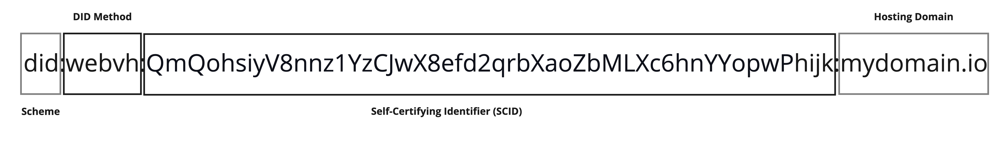

# Linux Kernel Maintainer Verification

[](https://github.com/FirstPersonNetwork/lkmv)

## Table of Contents

- [Core Concepts](#core-concepts)
- [Decentralised Identity](#decentralised-identity)
- [Decentralised Communication](#decentralised-communication)
- [Profiles and Configurations](#profiles-and-configurations)
  - [Public Configuration](#public-configuration)
  - [Secured Configuration](#secured-configuration)
- [Prerequisites](#prerequisites)
- [Set Up Environment](#set-up-environment)
  - [Same Domain with Multiple WebVH DIDs](#same-domain-with-multiple-webvh-dids)
- [Check Environment Setup](#check-environment-setup)
- [Feature Flags](#feature-flags)
- [LKMV Commands](#lkmv-commands)

## Core Concepts

- **Decentralised Identifiers (DIDs)** - A globally unique identifier that enables secure digital interactions. The DID is the cornerstone of Self-Sovereign Identity (SSI), a concept that aims to put individuals or entities in control of their digital identities. DID is usually associated with a cryptographic key pair and represented with different DID methods, each with its own benefits.

- **DIDComm Messaging Protocol** - An open standard for decentralised communication. Built on the foundation of Decentralised Identifiers (DIDs), it enables parties to exchange verifiable data such as credentials and establishes secure communication channels between parties without relying on centralised servers.

- **Verifiable Credentials (VCs)** - A digital representation of a claim attested by a trusted issuer about the subject (e.g., Individual or Organisation). VC is cryptographically signed and verifiable using cryptographic keys associated with the DID of the issuer.

- **Personhood Credential (PHC)** – A type of verifiable credential issued by any ecosystem (any qualified entity such as a company, university, nonprofit persona, government, etc.) that can attest to the credential holder being a real, unique person within that ecosystem. Part of PHC issuance is providing a verified identity verifiable credential issued by a trusted issuer.

- **Verifiable Relationship Credential (VRC)** - A type of verifiable credential issued peer-to-peer between holders of personhood credentials to attest to verifiable first-person trust relationships. The verifiable relationship credential validates your personhood credential.

## Decentralised Identity

The LKMV tool uses the did:webvh to create your Persona DID. WebVH is a DID method that enhances the existing did:web method, introducing:

- Verifiable history, providing a full history of DID document changes.

- Portability with a self-certifying identifier (SCID), allowing you to move to a different domain.

- Robust security by introducing a pre-rotation key and witness proof that approves changes to the DID.

To use the DID method, you must have a publicly available domain name that can host the DID log entries (did.jsonl) to resolve the DID successfully and retrieve the public key information and service endpoints for safe, secure, and private interaction with the persona.



## Decentralised Communication

The LKMV tool seamlessly integrates with any DIDComm-compatible mediator, facilitating secure, private, and decentralised communication using your Persona DID.

A DIDComm mediator plays a crucial role in message delivery while preserving privacy. It handles message routing and storage without ever accessing the message content, which remains encrypted end-to-end between sender and recipient.


When sending a message, it is structured in multiple layers called “envelopes” that provides robust security features, such as confidentiality, sender authenticity, non-repudiation, and sender anonymity.

## Profiles and Configurations

The tool supports multiple profiles, allowing you to represent different identities across various contexts within your environment.

To use a specific profile when running the tool, set the env variable `LKMV_CONFIG_PROFILE` with the name of your profile, for example:

```bash
export LKMV_CONFIG_PROFILE=profile-1
```

Setting the `LKMV_CONFIG_PROFILE` overrides any value set using the `-p/--profile` option.

Each profile manages two types of configurations:

### Public Configuration

Stored in JSON format, the public configuration contains environment-specific details such as:

- Persona DID.
- Mediator DID.
- Security mode (e.g., Unlock Codes or Hardware Token).

Config file location:

- Default profile: `~/.config/lkmv/config.json`
- Named profiles: `~/.config/lkmv/config-<PROFILE_NAME>.json`

You can change the default location where the public configuration is saved by setting the env variable `LKMV_CONFIG_PATH` with the new path, for example.

```bash
export LKMV_CONFIG_PATH=~/.config/lkmv-tool
```

Make sure that the new location exists before running the tool.

### Secured Configuration

Stored in the operating system’s secure storage, e.g., macOS Keychain or Linux Keyring.

The secured configuration includes:

- Private key material.
- Known contact DIDs.
- Encrypted Session Key (ESK), if using a hardware token.

If your profile uses both a hardware token and unlock code, the secured data is encrypted using the ESK.

For more details about secured configuration, refer to the [Handling Secured Configuration](./docs/handling-secured-configuration.md) documentation.

## Prerequisites

1. Rust version 1.88 or higher (Install [Rust](https://rust-lang.org/learn/get-started/)
   if needed)
2. Set any environment variables as needed
   - `LKMV_CONFIG_PATH`: Path to lkmv configuration files (default:
     `~/.config/lkmv/config.json`).
   - `LKMV_CONFIG_PROFILE`: Set a specific configuration profile (defaults to `default`).

     **NOTE:** Setting the `LKMV_CONFIG_PROFILE` overrides any value set using the `-p/--profile` option.

## Set Up Environment

1. Install the tool locally from the source.

```bash
cargo install –path .
```

> **NOTE:** This will change once the tool is published.

2. Run the setup wizard.

```bash
lkmv setup
```

If you wish to setup a different profile instead of **default**, set the `-p/--profile` option when running the setup.

```bash
lkmv -p profile-1 setup
```

Follow the setup steps to create the configuration, generate your Persona DID, and connect to a DIDComm mediator server.

### Same Domain with Multiple WebVH DIDs

To create different WebVH DIDs for the same domain name, set the URL during setup to:

```bash
✔ Enter the URL that will host your DID document (e.g., https://<your-domain>.com): https://affrncsp.github.io/profile1
```

The setup wizard creates a WebVH DID with the following value:

```bash
did:webvh:QmeQawCuEQFF28UNKxGcue4tKx3Vyc2bgknCPKKY61gCgh:mydomain.io:profile1
```

This is helpful when you want to setup multiple profiles with different WebVH DIDs for the same domain hosting the DID documents or when doing testing.

## Check Environment Setup

The LKMV configures your environment to ensure your setup is safe, secure, and private when running the tool.

To check the status or health of your current environment, run the following command.

```bash
lkmv status
```

If you wish to check the status for a specific profile, run the following the command.

```bash
lkmv -p profile-1 status
```

It displays the tool version, along with the DIDs configured, and whether your Persona DID is resolvable.

## Feature Flags

LKMV currently support two feature flags:

- **default:** Currently set to `openpgp-card`. To disable default features, use `--no-default-features` flag on the setup command.

- **openpgp-card:** Enables support for openpgp-card compatible devices. Set as the default feature.

## LKMV Commands

To run commands from an installed binary:

```bash
lkmv contacts list
```

To run commands from the source without building and installing the binary:

```bash
cargo run -- contacts list
```

Refer to the list of [LKMV Tool Commands](./docs/lkmv-tool-commands.md) documentation for all available commands and options.
