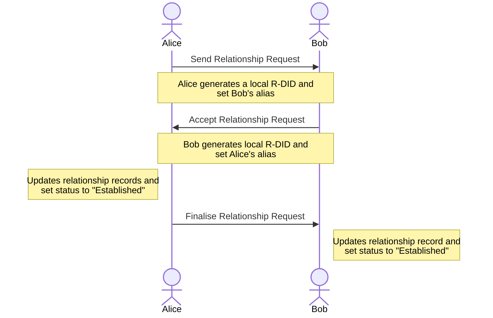

# Managing Relationship

The LKMV tool enables you to connect and establish a relationship with other DIDs, such as having a relationship with them as a peer, coworker, or someone you met at a community event. By establishing a relationship, you can communicate with them privately through the DIDComm protocol using either your **Community DID (C-DID)** or **Relationship DID (R-DID)**, if present.

Established relationships enable you to request a Verifiable Relationship Credential (VRC), an additional layer of trust and verification. VRC is a verifiable credential issued peer-to-peer between holders of personhood credentials, attesting to verifiable first-person trust relationships.




## Establishing a Relationship

Refer to the key steps to establish a relationship with another Community DID and request a Verifiable Relationship Credential (VRC) later.

### 1. Send Relationship Request (Requestor)

To create a relationship with others, use the following command:

```bash
lkmv relationships request --respondent <Community_DID> --alias <Respondent_Alias>
```

The above command will send a relationship request to the person owning the Community DID passed to the command as the respondent, and simultaneously set an alias for the relationship.

Initiating a relationship request automatically adds the respondent's Community DID, along with its alias (if present), to the Contacts list.

Optionally, you can generate a local Relationship DID (R-DID) when initiating a request using the following command:

```bash
lkmv relationships request --respondent <Community_DID> --alias <Respondent_Alias> --generate-did
```

If a Relationship DID (R-DID) is present in the relationship record, subsequent communication with the other party uses your local R-DID to communicate privately; otherwise, it uses C-DID.

For more details on the request command, refer to the [CLI documentation](./lkmv-tool-commands.md#lkmv-relationships-request).

### 2. Accept Relationship Request (Respondent)

To process and accept the relationship request, refer to the following steps:

1. Fetch tasks from the DIDComm mediator server.

```bash
lkmv tasks fetch
```

The tool fetches the messages from the mediator and stores them in a private configuration. If someone sends a relationship request, you should see a task with a task ID and type, in this case, `Relationship Request`.

2. Interact with the relationship requests using the following command:

```bash
lkmv tasks interact
```

Select the task ID that corresponds to the relationship request you would like to process.

3. Click on Accept this Relationship Request. The tool will prompt you to confirm your choice. 

4. The tool will ask you if you wish to generate a relationship DID (R-DID). The R-DID is used to establish a private channel with another party for secure communication; if an R-DID is not present, it uses your C-DID instead.

5. Enter the alias for the requester. It uses the alias for the relationship and the contacts list records.

    We recommend entering an alias to identify your relationships and contacts easily.

After entering the alias, the tool updates the relationship record to **`Request Accepted`** status and sends a response to the requestor regarding the acceptance of the request.

### 3. Finalise Relationship Request

After the respondent accepts the request, it sends a response to the requestor confirming the acceptance.

To finalise the request, the following steps must be done by both the requester and the respondent.

**Requestor:**

Requestor to fetch tasks from the mediator to update the relationship request from **`Request Sent`** to **`Established`** status. 

The LKMV tool will send a finalisation message regarding the relationship to the respondent.

**Respondent:**

After the requester finalises the relationship request, the tool sends another message informing the respondent about the relationship finalisation. 

The respondent must fetch the new message to finalise the relationship from **`Request Accepted`** to **`Established`** status.

After finalising the relationship on both requestor and respondent, you can ping each other to test the connectivity and request a Verifiable Relationship Credential.